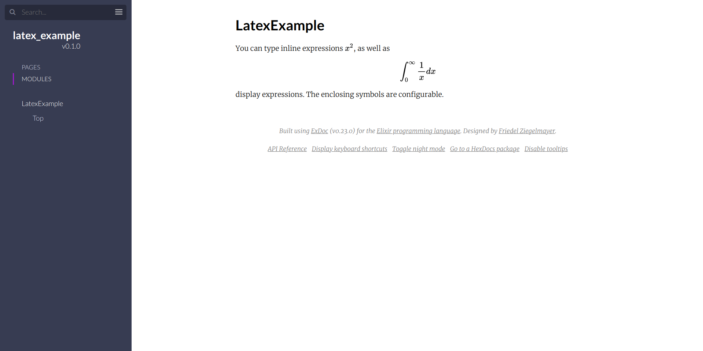

# ExDoc with LaTeX

Here you can find an example of rendering LaTeX expressions
 using [KaTeX](https://katex.org/) in documentation generated with ExDoc.
See [mix.exs](./mix.exs) for more details.

